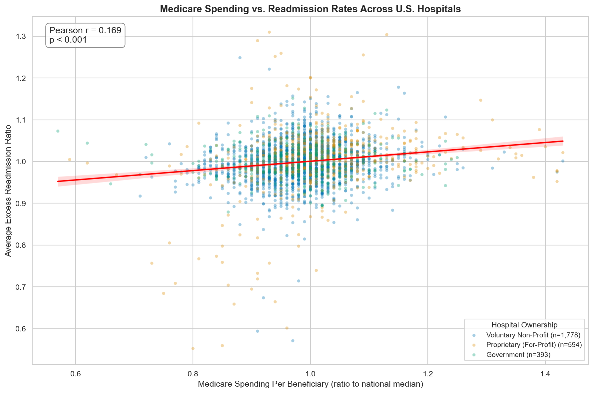
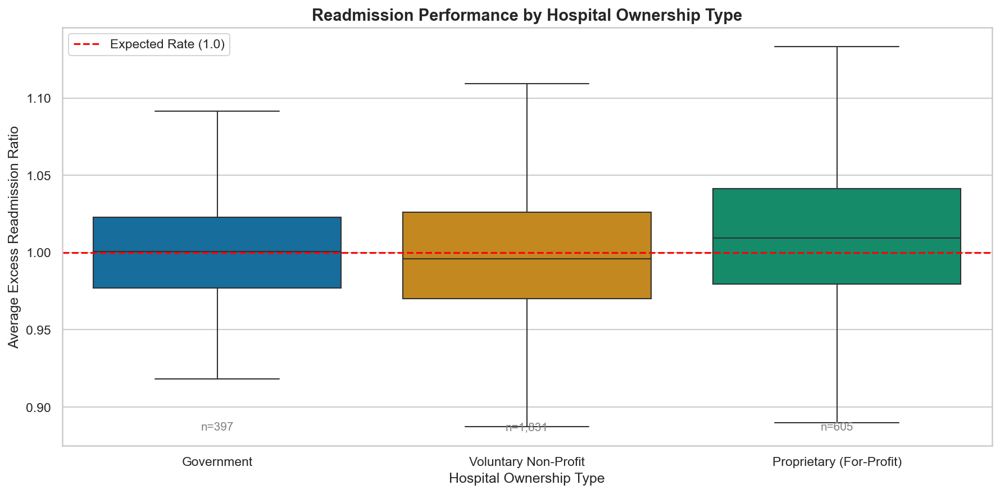
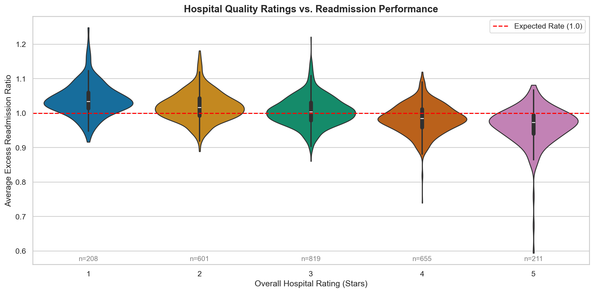

# Healthcare Spending & Hospital Readmissions Analysis

An analysis of ~3,000 U.S. hospitals exploring whether higher Medicare spending per patient episode leads to fewer hospital readmissions. Using three public datasets from the Centers for Medicare & Medicaid Services (CMS), this project reveals that spending more money does not translate to better readmission outcomes — and that hospital characteristics like ownership type and quality rating are stronger predictors of performance.

## Key Question

> **Does higher Medicare spending per hospital episode actually lead to fewer patient readmissions?**

## Data Sources

All data is publicly available from the [Centers for Medicare & Medicaid Services (CMS) Provider Data Catalog](https://data.cms.gov/provider-data/).

| Dataset | Description | Source |
|---------|-------------|--------|
| Hospital General Information | Hospital characteristics including location, type, ownership, and overall quality star rating | [CMS Provider Data](https://data.cms.gov/provider-data/dataset/xubh-q36u) |
| Hospital Readmissions Reduction Program | Excess readmission ratios for 6 medical conditions at each hospital | [CMS Provider Data](https://data.cms.gov/provider-data/dataset/9n3s-kdb3) |
| Medicare Spending Per Beneficiary | Hospital-level Medicare spending per patient episode relative to the national median | [CMS Provider Data](https://data.cms.gov/provider-data/dataset/rrqw-56er) |

## Methodology

1. **Data Acquisition:** Downloaded three CSV datasets programmatically from the CMS API
2. **Data Cleaning:** Handled non-numeric values ("Not Available", "Too Few to Report"), standardized facility IDs, and converted key metrics to proper numeric types
3. **Data Merging:** Inner-joined all three datasets on Facility ID, yielding ~3,000 hospitals with complete data
4. **Analysis:** Computed Pearson correlations, grouped comparisons by hospital characteristics, and created condition-specific breakdowns across the 6 HRRP conditions (AMI, Heart Failure, Pneumonia, COPD, Hip/Knee Replacement, CABG)

## Key Findings

- **Higher Medicare spending does NOT lead to fewer readmissions.** The correlation between spending per beneficiary and excess readmission ratios is weak to slightly positive — hospitals that spend more tend to have the same or slightly higher readmission rates.
- **Hospital ownership type matters.** Voluntary non-profit hospitals tend to outperform for-profit (proprietary) hospitals on readmission rates, suggesting financial incentive structures may influence outcomes.
- **Star ratings align with readmission performance.** There is a clear, monotonic relationship: 5-star hospitals have meaningfully lower readmission ratios than 1-star hospitals, validating the CMS quality rating system.
- **Heart failure and COPD have the highest readmission rates** among the 6 HRRP conditions, representing the biggest opportunities for targeted quality improvement.
- **Geographic variation exists**, with certain states consistently showing higher or lower readmission rates across hospitals.

## Sample Visualizations







## Tech Stack

- Python 3.x
- pandas, numpy — data wrangling and analysis
- matplotlib, seaborn — statistical visualizations
- plotly — interactive choropleth map
- scipy — statistical tests
- Jupyter Notebook — narrative analysis environment

## How to Run

```bash
git clone https://github.com/aboodshurbjy/healthcare-spending-analysis.git
cd healthcare-spending-analysis
pip install -r requirements.txt
jupyter notebook notebooks/analysis.ipynb
```

> **Note:** Raw data files are downloaded programmatically in the first notebook cell — no manual data download required.

## Author

Abood Shurbjy — Chemical & Biomolecular Engineering, University of Pennsylvania

## License

This project is licensed under the MIT License. See [LICENSE](LICENSE) for details.
